# Cyber-Threat-Mapping-with-MITRE-ATT-CK-Real-World-Case-Study

## Objective  
This project aims to map real-world cyber threats to the **MITRE ATT&CK framework**, focusing initially on a **narrative report** and later on analyzing **security logs**. By combining thorough threat analysis with automation, we streamline the process of identifying and classifying adversary tactics and techniques. Additionally, the project provides a breakdown of the **MITRE ATT&CK framework**, emphasizing its importance in **defensive strategies** for cybersecurity professionals.

## What is MITRE ATT&CK ?

The first question that comes to mind is: What is **MITRE ATT&CK**?  
MITRE ATT&CK is a comprehensive framework developed by the non-profit organization **MITRE** in 2013. It is based on real-world observations of adversary tactics, techniques, and procedures (TTPs) used in cyberattacks. The framework provides a structured way to document and understand the behavior of cyber adversaries, this helps cybersecurity teams anticipate, detect, and respond to threats more effectively.

## How It Works

**ATT&CK** is an open framework available to anyone at no charge via [attack.mitre.org](https://attack.mitre.org). It provides various features that help organizations and individuals understand adversary behavior in detail.

### 1. ATT&CK Matrices

**ATT&CK** offers three different matrices: **Enterprise**, **Mobile**, and **ICS (Industrial Control Systems)**. These matrices display adversary tactics and techniques in a structured manner.

- **ATT&CK Enterprise**: This matrix covers tactics and techniques for platforms such as Windows, macOS, Linux, PRE, Azure AD, Office 365, Google Workspace, SaaS, IaaS, Networks, and Containers.

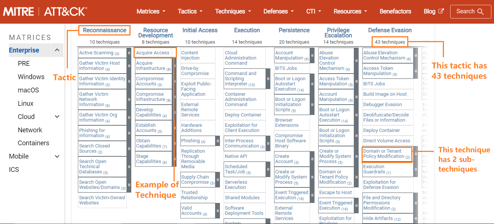
  
- **ATT&CK ICS**: Focuses on Industrial Control Systems, often used in critical infrastructure environments.

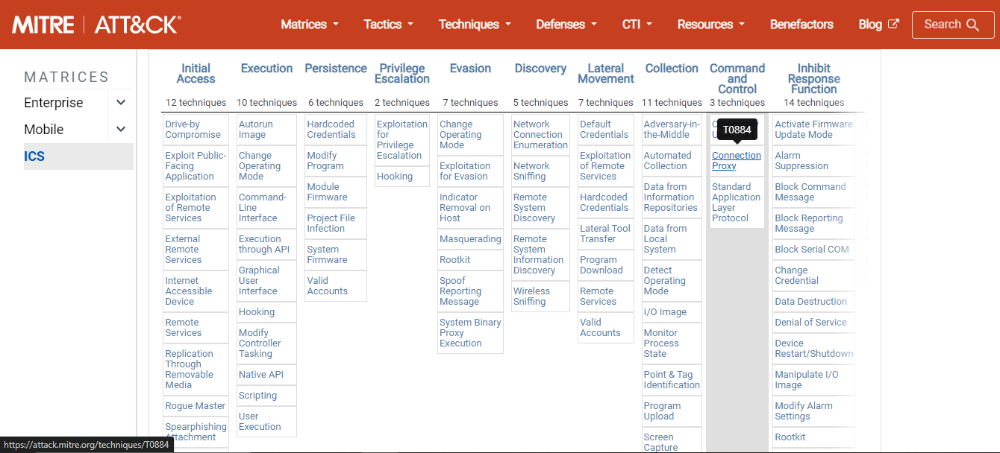

- **ATT&CK Mobile**: This matrix covers adversarial techniques involving device access and network-based effects for platforms such as Android and iOS.

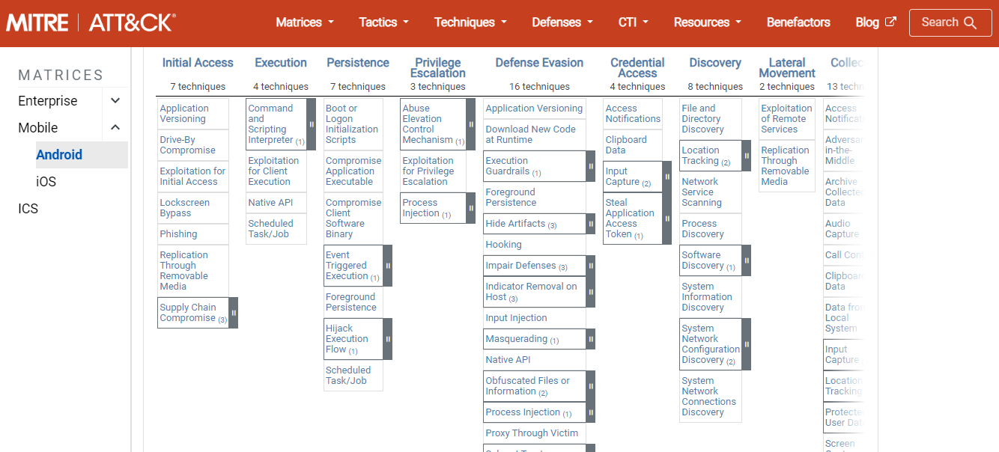

#### What are Tactics and Techniques?

- **Tactic (the why)**: This represents the adversary's goals or strategic objectives. Examples include:
  - **Initial Access**: Gaining entry into the target.
  - **Persistence**: Maintaining access to the target.
  - **Privilege Escalation**: Gaining higher-level permissions on the target.

- **Technique (the how)**: Each tactic consists of various techniques that describe the specific methods used to achieve these goals. For example:
  - The **Initial Access** tactic can be achieved using **phishing** (technique) via **spear phishing** (sub-technique of phishing).

### 2. MITRE Groups

MITRE ATT&CK tracks clusters of activity associated with specific **threat actors** known as "groups." For example:
- **ANDARIAL**: A known adversary group whose tactics and techniques are mapped and can be viewed on ATT&CK.

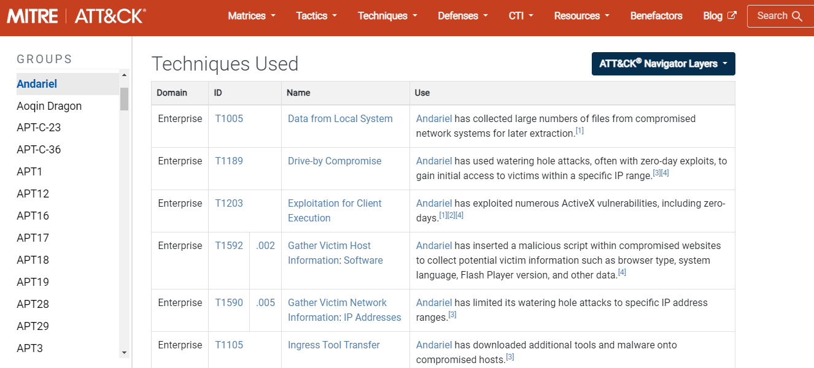

## What is the Importance of Knowing and Using MITRE ATT&CK?

1. **Enhanced Threat Intelligence**: ATT&CK provides a comprehensive repository of adversary tactics and techniques, enabling organizations to better understand the methods employed by threat actors.

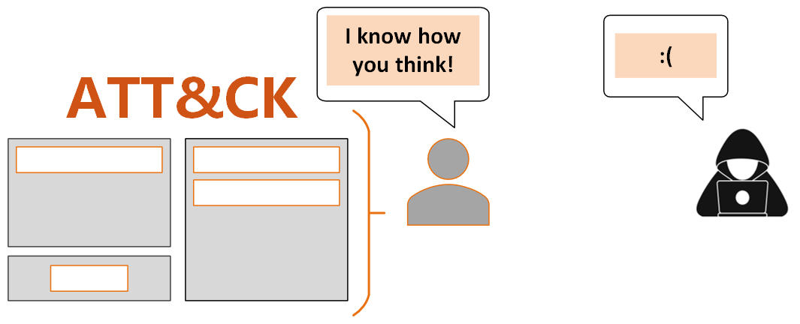

2. **Improved Detection and Response**: By mapping known techniques to their detection capabilities, security teams can enhance their monitoring and incident response strategies, leading to quicker and more effective mitigations.

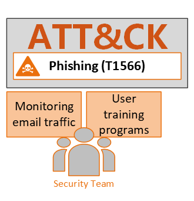

3. **Proactive Defense Strategies**: Knowledge of ATT&CK allows organizations to anticipate potential threats and implement measures to defend against specific tactics that adversaries may employ.

4. **Standardized Language**: ATT&CK offers a common language for discussing adversary behavior, facilitating communication between security teams, threat analysts, and stakeholders.

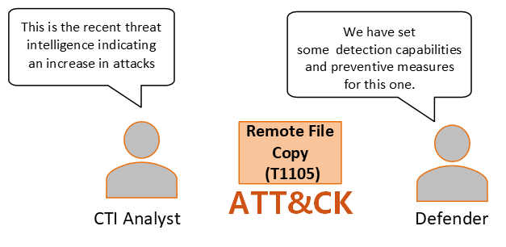

5. **Training and Awareness**: The framework serves as a valuable resource for training security personnel, helping them to recognize and respond to tactics used in real-world attacks.

6. **Assessment and Improvement**: Organizations can use ATT&CK to assess their security posture, identify gaps in defenses, and prioritize improvements based on real-world threat intelligence.

## What is Mapping and Why is It Important?

**Mapping** in the context of the MITRE ATT&CK framework involves correlating observed adversary behaviors—whether from narrative reports or security logs—to specific tactics and techniques within the framework. This process helps organizations understand how actual attacks align with known adversary behaviors.

### Importance of Mapping

1. Povides a clear view of how threats manifest in the real world, allowing organizations to better prepare for similar attacks.

2. Identify areas where defenses may be lacking and prioritize improvements accordingly.

3. Understanding the tactics and techniques relevant to their environment enables organizations to make informed decisions about security tools and technologies to invest in.

4. Mapping historical incidents helps security teams refine their incident response plans, ensuring they are better prepared for future attacks that employ similar techniques.

5. Proactively seek indicators of compromise (IOCs) associated with specific techniques.

Steps:

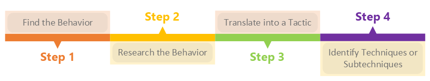

## How to Map to ATT&CK from Narrative Reports?

The first part of this project focuses on mapping cyber threat activity to the MITRE ATT&CK framework using narrative reports. For this purpose, we have selected a real-world case study, the **"STATIC KITTEN Adversary"**, taken from the **CrowdStrike 2024 Threat Hunting Report** (pages 31-35). You can access the report [here](https://www.crowdstrike.com/resources/reports/threat-hunting-report/).

In the following sections, we will analyze this case in detail and map the observed adversary tactics, techniques, and procedures (TTPs) to the relevant ATT&CK framework categories, following the four steps mentioned previously.

**Step 1: Let's Find the Behavior**

In this step, the objective is to **closely** analyze the narrative report and extract key details about the adversary's actions during the cyber intrusion. 

The first thing to do is looking for **key events** in the report that describe the adversary's actions throughout the attack, with a focus on the verbs and actions described in the narrative. These verbs will help identify what the adversary did, which can then be mapped to specific tactics or techniques in the MITRE ATT&CK framework. 

All this could be broken down into three phases:

**- Pre-compromise:** What preparation or reconnaissance activities did the adversary perform before the initial compromise?

In this phase, the adversary often conducts reconnaissance or preparation activities before the actual compromise.

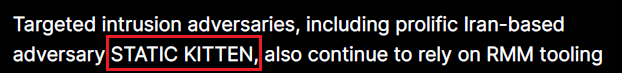

The adversary in this case is the STATIC KITTEN group. After searching ATT&CK's group section without results, additional research on STATIC KITTEN reveals:
-Active since at least early 2017.
-Primarily targets regions like the Middle East, Eurasia, and Central Asia.
-Known for PowerShell-based malware families, such as NTSTATS and CloudSTATS.
-Their main method of delivery involves spear-phishing emails with malicious Microsoft Word documents as attachments.

This indicates that STATIC KITTEN likely performed reconnaissance by gathering professional email information and other details about the targets to craft spear-phishing emails.

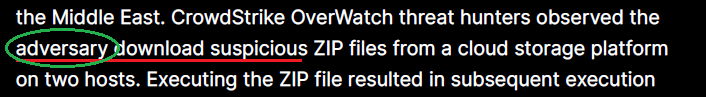

The report also highlights that the adversary downloaded suspicious ZIP files from a cloud storage platform to two hosts, which could suggest preparatory efforts to deliver their malicious payload.

**- Initial compromise:** How did the adversary gain access to the victim's system or network? 

This phase covers how the adversary **gained access** to the victim's system or network.

According to the report, STATIC KITTEN used **phishing activity** to deliver tools like ScreenConnect and Atera to government, telecom, and technology entities in the Middle East and South Asia.

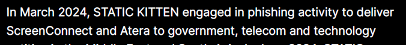

In one instance, they used the Atera RMM tool during a spear-phishing campaign against a healthcare entity in the Middle East.
The adversary’s primary method of initial access seems to involve spear-phishing emails that deliver malicious ZIP files from cloud storage providers.

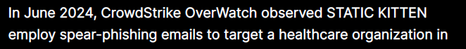

**- Post-compromise:** What did the adversary do after gaining access?

After gaining access, the adversary continues their operations by waiting for the victim to upload and execute malicious files.

In this case, the malicious file is an MSI installer for Atera Agent remote management software. Executing the ZIP file results in the installation of the Atera MSI, which gives the adversary persistent access.

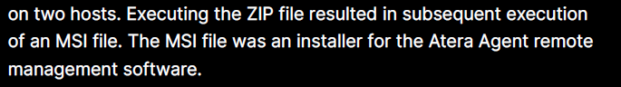

The report mentions that at least six additional hosts attempted to retrieve the same ZIP file, suggesting a broad spear-phishing campaign targeting multiple users.

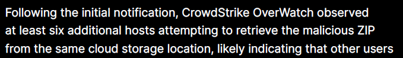

To maintain persistence, STATIC KITTEN relies on legitimate RMM tools like Atera, delivered via MSI files, making detection more challenging for defenders.
They also often rename installer files to evade detection.

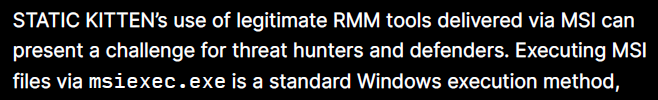

STATIC KITTEN is known to reuse techniques across campaigns, although they may update or rewrite their tooling. While they may use a different RMM tool, their method of delivering it through cloud storage providers often remains the same.

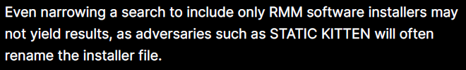

**Step 2: Research the Behavior**

In this step, we need to gather **deeper insights** into the specific behaviors mentioned in the report about STATIC KITTEN and their use of remote management tools (RMM) and spear-phishing campaigns. This will help us understand the technical details and context, aiding in a more precise mapping to MITRE ATT&CK.

**1. Adversary Tools and Techniques**

[Atera](https://www.atera.com/fr/) and [ScreenConnect](https://screenconnect.connectwise.com/) are legitimate remote management tools often abused by adversaries for persistence or lateral movement. We need to examine how these tools are used for malicious purposes:

- Atera RMM is designed for remote monitoring and management but can be exploited by adversaries to maintain persistence in compromised systems.
- ScreenConnect is a remote desktop tool that, if used maliciously, enables adversaries to control a victim’s machine remotely.
  
Both tools allow adversaries to hide in plain sight since these are legitimate software often found in IT environments.

**2. Spear-Phishing**

The report highlights the use of spear-phishing emails to deliver ZIP files containing malicious payloads. We should research known spear-phishing techniques:

- How adversaries craft phishing emails to evade detection (e.g., spoofing trusted entities or leveraging social engineering).
- The use of MSI installers to deliver malware, which can be tricky to detect because MSI files are standard Windows files used to install legitimate software.
  
**3. Network Protocols and Infrastructure**

Msiexec.exe, a standard Windows process used to execute MSI installers, is leveraged in this campaign. We should research:

- How msiexec.exe is used in attacks (e.g., running an installer via command line).
- HTTP/HTTPS usage for downloading the malicious ZIP file from cloud storage, which might evade detection due to its common use in corporate environments.
  
**Step 3: Translate the Behavior into a Tactic**

To properly map the behavior of the adversary from the STATIC KITTEN report to the appropriate MITRE ATT&CK tactics, we need to understand their overall goals at each phase of the attack. Here's the breakdown:

- Pre-compromise Phase
**Reconnaissance:**
  
The adversary is gathering information on the target, such as email addresses and professional information, which they can use for future spear-phishing campaigns.

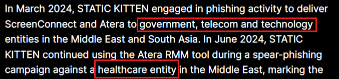

Behavior: Collecting email addresses and organizational information from the target.

MITRE ATT&CK Tactic: Reconnaissance (TA0043)

**Resource Development:**

The adversary is preparing for the attack by setting up the necessary infrastructure, such as crafting malicious spear-phishing emails and downloading ZIP files with malicious payloads.

Behavior: Downloading ZIP files and crafting spear-phishing emails for delivery.

MITRE ATT&CK Tactic: Resource Development (TA0042)

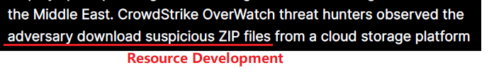

- Initial Compromise Phase
**Initial Access:**
  
The adversary gains entry into the target network by sending spear-phishing emails with malicious attachments. In this case, the delivery method includes ZIP files containing MSI installers, which are opened by the victim.

Behavior: Spear-phishing emails used to deliver malicious payloads (e.g., ZIP files, MSI installers).

MITRE ATT&CK Tactic: Initial Access (TA0001)

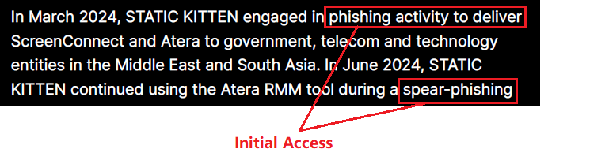

- Post-compromise Phase
**Execution:**
  
After the initial compromise, the adversary runs the malicious code by executing the MSI files, which install RMM tools (Atera or ScreenConnect) on the victim’s system.

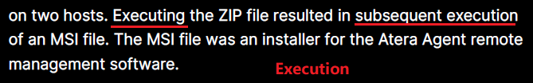

Behavior: Execution of MSI installers to deploy Atera or ScreenConnect RMM tools.

MITRE ATT&CK Tactic: Execution (TA0002)

**Persistence:**

The adversary establishes persistence in the network by using legitimate RMM tools that allow them to maintain access over time. They use Atera RMM and ScreenConnect, which enable remote control of the victim's machine.

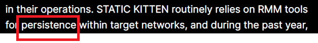

Behavior: Using legitimate RMM tools (Atera, ScreenConnect) to maintain access.

MITRE ATT&CK Tactic: Persistence (TA0003)

**Defense Evasion:**

The adversary evades detection by using legitimate tools (like MSI installers and RMM tools) to blend in with legitimate traffic. They rename the installer files and use standard Windows processes (msiexec.exe) to avoid raising suspicions.

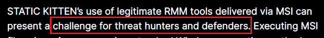

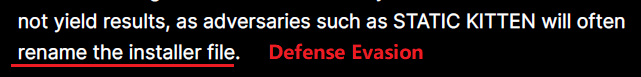

Behavior: Using legitimate RMM tools and renaming installer files to avoid detection.

MITRE ATT&CK Tactic: Defense Evasion (TA0005)

**Lateral Movement:**

The adversary moves within the network, potentially using the same RMM tools to access multiple systems after the initial compromise. There are indications that multiple hosts were targeted, suggesting lateral movement.

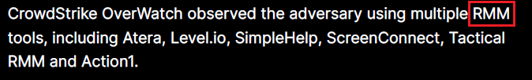

Behavior: Using RMM tools to move laterally within the victim’s network.

MITRE ATT&CK Tactic: Lateral Movement (TA0008)

**Command and Control:**

The adversary maintains control over the compromised systems using RMM tools. These tools allow the adversary to issue commands remotely, effectively controlling the victim’s machine.

Behavior: Using RMM tools for remote control and maintaining communication with compromised systems.

MITRE ATT&CK Tactic: Command and Control (TA0011)

**Step 4: Identify What Technique & Sub-Technique Applies**

## Overview of Step 4

In this step, the goal is to identify the relevant **MITRE ATT&CK techniques** and **sub-techniques** associated with the observed adversarial behavior. This can be challenging because:

- Techniques are not always obvious and may serve multiple tactics (e.g., Persistence, Privilege Escalation, Defense Evasion).
- Not every action or behavior can be mapped to a technique, and context is key to determining whether an activity is malicious.
- The level of detail in a report might influence whether you identify the technique or sub-technique first.

### How We Identify Techniques/Sub-Techniques:
- **Search through the ATT&CK framework** using keywords, procedures, or command strings.
- **Review the tactics** (identified in the earlier step) and assess the corresponding techniques and sub-techniques.
- **Contextualize the behavior** based on the adversary's tactics and actions.

Below is a breakdown of techniques and sub-techniques for each tactic identified in the adversary's behavior. 

---

## Reconnaissance

### Technique: [Gather Victim Org Information (T1591)](https://attack.mitre.org/techniques/T1591/)
- **Sub-technique**: [Identify Roles (T1591.002)](https://attack.mitre.org/techniques/T1591/002/)
  
  **How it was identified**:  
  Adversaries need to gather information about the victim organization to target phishing emails effectively. In this case, the adversary is likely collecting details about specific personnel and their roles to identify high-value targets.

  **Explanation**:  
  This technique is used when an attacker gathers detailed information about the victim organization, such as employees' roles or decision-making power. This allows them to direct more personalized phishing attacks.

  **Justification**:  
  The phishing behavior described implies that the adversary must first gather information about the organization's structure, specifically identifying key personnel like IT administrators.

---

## Resource Development

### Technique: [Obtain Capabilities (T1587)](https://attack.mitre.org/techniques/T1587/)
- **Sub-technique**: [Obtain Tool (T1587.001)](https://attack.mitre.org/techniques/T1587/001/)
  
  **How it was identified**:  
  The adversary is seen downloading files from cloud storage, suggesting they are obtaining the necessary malware or tools for the attack.

  **Explanation**:  
  Attackers frequently acquire tools from external sources, such as cloud storage or third-party repositories, to prepare for an attack. This might include malware, exploit kits, or other necessary software.

  **Justification**:  
  The report mentions file downloads, indicating the attacker is preparing for the attack by obtaining malicious software, falling under **Obtain Capabilities**.

---

## Initial Access

### Technique: [Phishing (T1566)](https://attack.mitre.org/techniques/T1566/)
- **Sub-technique**: [Spearphishing Attachment (T1566.001)](https://attack.mitre.org/techniques/T1566/001/)
  
  **How it was identified**:  
  The report explicitly mentions a phishing email with a malicious attachment, which suggests the **Spearphishing Attachment** sub-technique.

  **Explanation**:  
  This is a classic spear-phishing method where the attacker sends an email with a malicious file attached. When the victim opens the file, the malware is executed.

  **Justification**:  
  The report describes the phishing method, making this technique and sub-technique the most appropriate choice.

---

## Execution

### Technique: [User Execution (T1204)](https://attack.mitre.org/techniques/T1204/)
- **Sub-technique**: [Malicious File (T1204.002)](https://attack.mitre.org/techniques/T1204/002/)
  
  **How it was identified**:  
  The adversary relies on the victim to open the phishing attachment, triggering the execution of a malicious file.

  **Explanation**:  
  Once the phishing attachment is opened, the malicious file is executed by the victim. This is a common technique where user interaction (clicking a link, opening a file) is needed to start the attack.

  **Justification**:  
  The adversary's success depends on user interaction with a **malicious file**, fitting this sub-technique.

### Technique: [System Services (T1569)](https://attack.mitre.org/techniques/T1569/)
- **Sub-technique**: [Service Execution (T1569.002)](https://attack.mitre.org/techniques/T1569/002/)
  
  **How it was identified**:  
  The malicious file uses **msiexec.exe** to execute the payload, which is an example of **Service Execution**.

  **Explanation**:  
  **msiexec.exe** is a Windows utility used for installing MSI packages. The attacker uses this system service to run their malicious payload, allowing the code to execute as part of a trusted system process.

  **Justification**:  
  The use of **msiexec.exe** makes this a clear case of system service-based execution.

---

## Persistence

### Technique: [Create or Modify System Process (T1543)](https://attack.mitre.org/techniques/T1543/)
- **Sub-technique**: [Windows Service (T1543.003)](https://attack.mitre.org/techniques/T1543/003/)
  
  **How it was identified**:  
  The adversary creates or modifies Windows services to ensure their malware remains persistent across system reboots or restarts.

  **Explanation**:  
  Modifying or creating a Windows service ensures the malware can restart after a reboot or remain active long-term without raising immediate suspicion.

  **Justification**:  
  By manipulating legitimate system processes, the adversary can maintain their access, which aligns with this technique.

---

## Defense Evasion

### Technique: [Trusted Developer Utilities Proxy Execution (T1218)](https://attack.mitre.org/techniques/T1218/)
- **Sub-technique**: [Msiexec (T1218.007)](https://attack.mitre.org/techniques/T1218/007/)
  
  **How it was identified**:  
  The use of **msiexec.exe**, a trusted Windows utility, allows the attacker to evade detection by using legitimate software to run malicious payloads.

  **Explanation**:  
  Trusted system utilities like **msiexec.exe** are often allowed by security software, so using them to execute malicious code is a common evasion technique.

  **Justification**:  
  This technique allows the adversary to avoid detection by using a trusted, built-in Windows tool for malicious purposes.

---

## Lateral Movement

### Technique: [Exploitation of Remote Services (T1210)](https://attack.mitre.org/techniques/T1210/)
  
  **How it was identified**:  
  The adversary uses **Remote Management Tools (RMM)** like **Atera** and **ScreenConnect** to move laterally through the network, exploiting these legitimate services.

  **Explanation**:  
  By exploiting remote services, the attacker can move between different systems within the network. RMM tools are often used for lateral movement as they provide access to other systems remotely.

  **Justification**:  
  The use of legitimate remote management services for lateral movement matches this technique.

---

## Command and Control

### Technique: [Remote Access Software (T1219)](https://attack.mitre.org/techniques/T1219/)
  
  **How it was identified**:  
  The adversary maintains control over the compromised system using remote access tools like **Atera** and **ScreenConnect**.

  **Explanation**:  
  These remote access tools enable the attacker to issue commands, exfiltrate data, or perform other malicious actions from a remote location.

  **Justification**:  
  The tools mentioned in the report are designed for remote access, which makes this the appropriate command and control technique.

---

# Summary of Techniques and Sub-techniques

1. **Reconnaissance**:  
   - Gather Victim Org Information (T1591) → Identify Roles (T1591.002)

2. **Resource Development**:  
   - Obtain Capabilities (T1587) → Obtain Tool (T1587.001)

3. **Initial Access**:  
   - Phishing (T1566) → Spearphishing Attachment (T1566.001)

4. **Execution**:  
   - User Execution (T1204) → Malicious File (T1204.002)  
   - System Services (T1569) → Service Execution (T1569.002)

5. **Persistence**:  
   - Create or Modify System Process (T1543) → Windows Service (T1543.003)

6. **Defense Evasion**:  
   - Trusted Developer Utilities Proxy Execution (T1218) → Msiexec (T1218.007)

7. **Lateral Movement**:  
   - Exploitation of Remote Services (T1210)

8. **Command and Control**:  
   - Remote Access Software (T1219)

